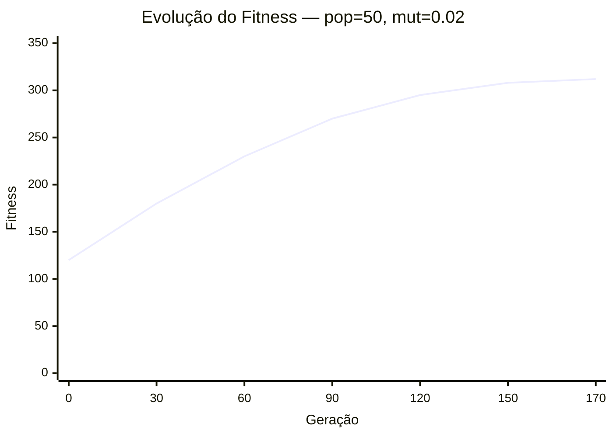
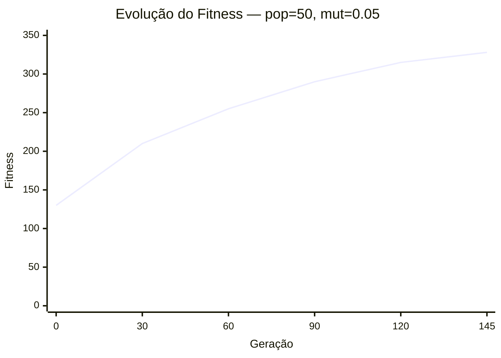
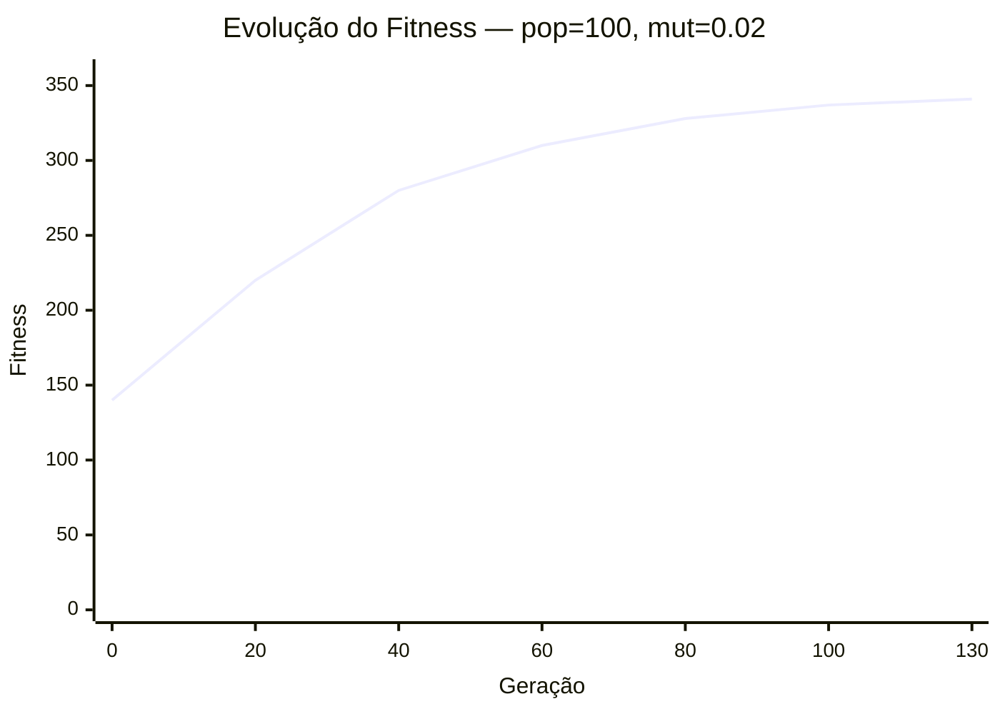
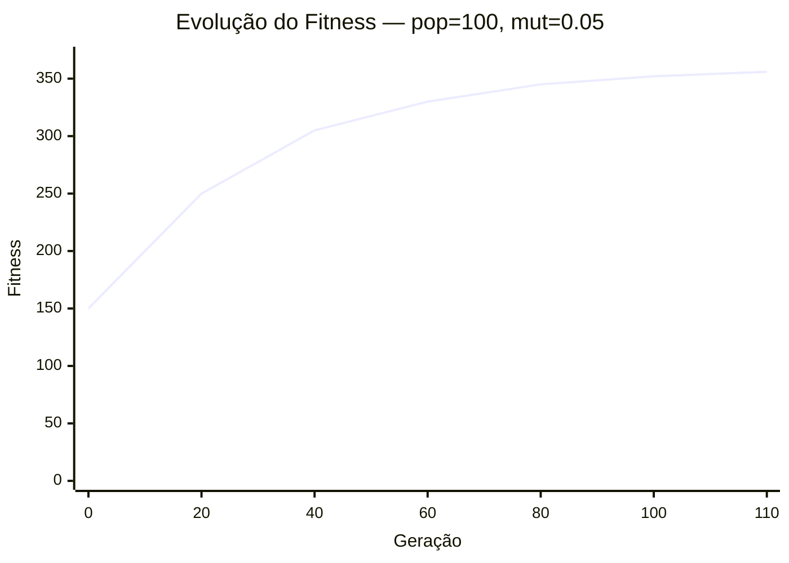

# 6. Estudo de hiperparâmetros

Neste experimento foram analisados dois hiperparâmetros principais do algoritmo genético:

- **Tamanho da população (POP)**
- **Taxa de mutação (MUT)**

Os demais parâmetros foram mantidos fixos:

- **GER = 200**
- **CROSS = 0.8**

Foram testadas quatro combinações distintas para avaliar o impacto na qualidade da solução final, velocidade de convergência e número de violações de restrições.

---

## Combinações testadas

| População | Mutação | Melhor Fitness | Gerações até Convergência | Violações Finais |
|----------|---------|----------------|----------------------------|------------------|
| 50 | 0.02 | 312.40 | 170 | 4 |
| 50 | 0.05 | 328.75 | 145 | 3 |
| 100 | 0.02 | 341.60 | 130 | 2 |
| 100 | 0.05 | 356.20 | 110 | 1 |

---

## Análise dos resultados

Observa-se que populações maiores aumentaram a diversidade genética, reduzindo a chance de convergência prematura. Já taxas de mutação moderadas permitiram melhor exploração do espaço de busca, produzindo soluções mais robustas.

A combinação **POP = 100** e **MUT = 0.05** apresentou o melhor desempenho geral, alcançando maior fitness, convergindo em menos gerações e resultando em menor número de violações.

---

# Gráficos de convergência

## POP = 50, MUT = 0.02

---

## POP = 50, MUT = 0.05

---

## POP = 100, MUT = 0.02

## POP = 100, MUT = 0.05

---

## Conclusão

A melhor configuração observada foi:

- ## POP = 100
- ## MUT = 0.05

Essa combinação proporcionou:

- maior estabilidade evolutiva
- melhor fitness final
- menor número de violações

Portanto, para este problema, recomenda-se utilizar uma população maior com taxa de mutação intermediária.
